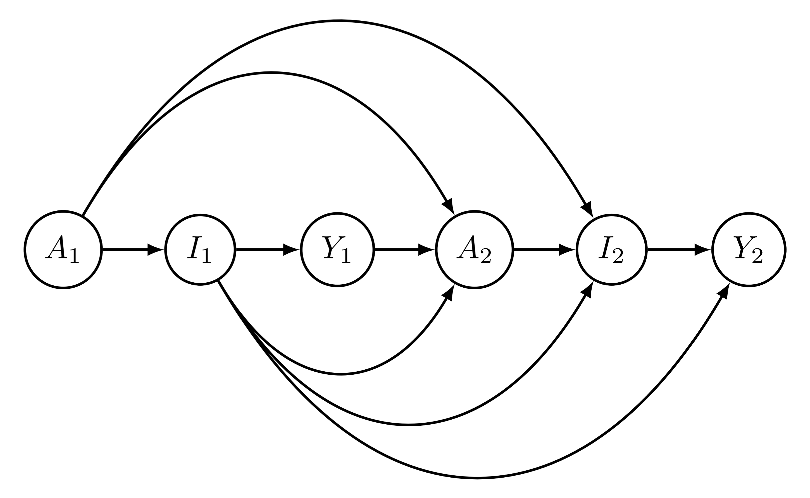

The study is based on this [Paper](https://arxiv.org/pdf/2103.04472.pdf).

## Model Identification (Homework 2)

## [A Causal Question to Study (Homework 1)](https://github.com/Yancheng-Li-Stat/Yancheng-Li-Stat.github.io/blob/master/Stat-888/HW1.pdf)

Directed acyclic graph:

